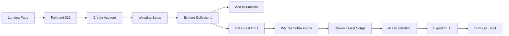

# Product Requirements Document: Uptune Weddings v2.0

**Version:** 2.0  
**Date:** January 2025  
**Product Owner:** Uptune Team  
**Document Status:** Final with UI Specifications

---

## 1. Executive Summary

### 1.1 Product Vision
Uptune Weddings is a streamlined web application that enables couples and wedding planners to create perfect wedding music playlists in 20 minutes through expert-curated song libraries, guest collaboration, and AI-powered organization.

### 1.2 Key Value Proposition
"Perfect wedding music in 20 minutes for $25 – powered by expert curation, guest collaboration, and AI"

### 1.3 Core Differentiators
1. **Expert Curation Over Endless Choice** - 500+ pre-vetted songs vs. millions
2. **Guest Collaboration Built-In** - Viral loop through song requests
3. **AI as Assistant, Not Autopilot** - Smart suggestions while maintaining control
4. **Wedding-Specific Organization** - 11 moments, not generic playlists

### 1.4 Target Release
MVP: Q2 2025

---

## 2. User Interface Architecture

### 2.1 Three-Panel System

#### Left Panel (280px) - Custom Song Search
**Purpose:** Add any song not in curated collections
- Search bar with real-time results
- Smart filters: Genre, Era, Energy, Content rating
- Quick-add buttons on hover
- Addresses "our special song" use cases

#### Center Panel (Flexible) - Discovery & Review
**Two tabbed views:**
1. **Curated Collections** - Expert playlists by moment
2. **Guest Requests** - Review and approve submissions

#### Right Panel (400px) - Wedding Timeline Builder
**Purpose:** Organize songs by wedding moments
- Visual timeline with 11 pre-defined moments
- Drag-and-drop interface
- Real-time duration tracking
- Export actions at bottom

### 2.2 Key UI Components

#### Header
- Progress tracking (time spent, total songs)
- "Get Guest Input" CTA with count badge
- Brand gradient: #E91E63 to #9C27B0

#### Guest Input Modal
- Email collection interface
- Custom message field
- Batch invite functionality
- Clean, wedding-themed design

---

## 3. Core Features (Detailed)

### 3.1 Curated Song Collections

**Implementation Requirements:**
```javascript
// Collection Structure
{
  id: "classic-processional",
  name: "Classic Processional",
  icon: "💐",
  description: "Timeless elegance for your walk down the aisle",
  moment: "processional",
  songs: [
    {
      id: "spotify:track:123",
      title: "Canon in D",
      artist: "Pachelbel",
      duration: 343, // seconds
      bpm: 64,
      energy_level: 2,
      explicit: false,
      generation_appeal: ["boomer", "gen_x", "millennial"],
      preview_url: "https://..."
    }
  ],
  stats: {
    total_songs: 25,
    avg_rating: 4.9,
    times_used: 1247
  }
}
```

**UI Behavior:**
- Click collection → Expand to show all songs
- Drag entire collection → Add all songs to timeline
- Individual song preview on hover (Spotify 30s)
- One-click add from any collection

### 3.2 Guest Collaboration System

**Email Collection Flow:**
1. Click "Get Guest Input" → Modal opens
2. Add emails individually or paste list
3. Optional: Customize message
4. Send → Each guest receives unique link

**Guest Experience:**
```
Email Subject: "Help us pick wedding songs! 🎵"
Body: Custom message + link to simple form
Landing: Mobile-first, no sign-up required
Actions: Submit 3 songs + optional message
```

**Host Review Interface:**
- Dedicated tab showing all submissions
- Aggregate voting data ("8 guests requested")
- One-click approve/reject
- Explicit content warnings
- Auto-deduplication

**Database Schema:**
```sql
-- Guest Submissions
CREATE TABLE guest_submissions (
  id UUID PRIMARY KEY,
  wedding_id UUID REFERENCES weddings(id),
  guest_email VARCHAR(255),
  song_spotify_id VARCHAR(50),
  song_title VARCHAR(255),
  song_artist VARCHAR(255),
  message TEXT,
  submitted_at TIMESTAMP,
  status ENUM('pending', 'approved', 'rejected')
);

-- Aggregated for display
CREATE VIEW submission_summary AS
SELECT 
  song_spotify_id,
  COUNT(*) as request_count,
  array_agg(message) as messages
FROM guest_submissions
GROUP BY song_spotify_id;
```

### 3.3 AI Wedding Assistant

**Three Core Functions:**

1. **Generate Perfect Mix**
   - Input: Guest demographics, venue type, couple preferences
   - Output: Balanced playlist across all moments
   - Algorithm: Energy flow, generation balance, genre mixing

2. **Analyze Guest Preferences**
   - Input: All guest submissions
   - Output: Insights like "Your crowd loves 90s R&B"
   - Show top requested genres, artists, energy levels

3. **Fix Energy Flow**
   - Input: Current timeline
   - Output: Specific suggestions with reasoning
   - Example: "Add upbeat transition between dinner and dancing"

**Implementation:**
```python
def analyze_energy_flow(timeline):
    issues = []
    for i in range(len(timeline) - 1):
        current = timeline[i]
        next_moment = timeline[i + 1]
        
        # Check energy transitions
        if current.avg_energy < 3 and next_moment.avg_energy > 4:
            issues.append({
                "type": "abrupt_energy_jump",
                "location": f"Between {current.name} and {next_moment.name}",
                "suggestion": "Add medium-energy buffer songs"
            })
    
    return issues
```

### 3.4 Timeline Builder

**Moments & Default Durations:**
1. Prelude (30 min) - Guest arrival
2. Processional (5 min) - Wedding party entrance  
3. Ceremony (20 min) - Vows and rings
4. Recessional (5 min) - Exit celebration
5. Cocktail Hour (60 min) - Mingling
6. Grand Entrance (5 min) - Reception start
7. Dinner (60 min) - Meal service
8. First Dance (4 min) - Couple's dance
9. Parent Dances (8 min) - Traditional dances
10. Dance Floor (120 min) - Party time
11. Last Dance (5 min) - Send-off

**Smart Features:**
- Auto-calculate total duration
- Visual energy flow indicator (graph)
- Duplicate song warnings
- BPM transition analysis
- Generation balance meter

### 3.5 Export System

**Spotify Export:**
- One-click playlist creation
- Organized by moment (sub-playlists)
- Maintains song order
- Public/private options

**DJ Package Includes:**
```
PDF Format:
- Cover page with couple info
- Timeline with specific times
- Complete song list by moment
- Do Not Play list
- Guest request analytics
- Special notes/instructions
- Energy flow visualization

Additional Formats:
- CSV with all metadata
- Spotify playlist links
- Text file for other systems
```

---

## 4. User Flows (Refined)

### 4.1 Primary Flow - Couple Journey



### 4.2 Guest Flow
1. **Receive Email** → Personalized invitation
2. **Click Link** → No sign-up required
3. **View Instructions** → See couple's message
4. **Search Songs** → Spotify-powered search
5. **Submit 3 Songs** → With optional messages
6. **See Others' Picks** → Vote on submissions
7. **Thank You** → Confirmation screen

### 4.3 Decision Points
- **No Spotify?** → Manual search by title/artist
- **Explicit Songs?** → Flag for couple review
- **Duplicate Requests?** → Show aggregated count

---

## 5. Technical Specifications

### 5.1 Frontend Architecture
```javascript
// React Component Structure
- App.jsx
  - Header.jsx
    - ProgressTracker.jsx
    - GuestInputButton.jsx
  - MainLayout.jsx
    - LeftPanel/
      - SongSearch.jsx
      - FilterSection.jsx
      - SearchResults.jsx
    - CenterPanel/
      - ViewTabs.jsx
      - CuratedView/
        - AIAssistant.jsx
        - CollectionGrid.jsx
        - CollectionCard.jsx
      - GuestView/
        - SubmissionStats.jsx
        - ReviewList.jsx
    - RightPanel/
      - Timeline.jsx
      - MomentSection.jsx
      - ExportActions.jsx
  - Modals/
    - GuestInputModal.jsx
```

### 5.2 State Management
```typescript
interface WeddingState {
  wedding: {
    id: string;
    coupleNames: string[];
    date: Date;
    venueType: string;
    guestCount: number;
  };
  timeline: {
    [momentId: string]: Song[];
  };
  guestSubmissions: {
    pending: Submission[];
    approved: Submission[];
    rejected: Submission[];
  };
  ui: {
    activeView: 'curated' | 'guests';
    selectedMoment: string;
    searchQuery: string;
    filters: FilterState;
  };
}
```

### 5.3 API Endpoints

```yaml
# Song Library
GET /api/collections
GET /api/collections/{id}/songs
GET /api/songs/search?q={query}&filters={...}

# Guest Collaboration  
POST /api/weddings/{id}/invites
GET /api/weddings/{id}/submissions
PATCH /api/submissions/{id}/status

# AI Features
POST /api/ai/generate-mix
POST /api/ai/analyze-preferences
POST /api/ai/optimize-flow

# Export
POST /api/export/spotify
GET /api/export/dj-package/{format}
```

### 5.4 Performance Requirements
- Initial load: <2s
- Search results: <300ms
- Drag-drop: <16ms (60fps)
- Auto-save: Every 10 seconds
- Spotify preview: <500ms to start

---

## 6. Analytics & Success Metrics

### 6.1 Key Metrics
- **Activation Rate**: % who add first song
- **Completion Rate**: % who export playlist
- **Time to Complete**: Target <20 minutes
- **Guest Participation**: Target 60%+
- **Viral Coefficient**: Referrals per wedding

### 6.2 Event Tracking
```javascript
// Key events to track
analytics.track('Collection Viewed', {
  collectionId: 'dance-floor-guaranteed',
  songCount: 150,
  moment: 'dance_floor'
});

analytics.track('Guest Invite Sent', {
  guestCount: 24,
  customMessage: true
});

analytics.track('Song Approved', {
  source: 'guest_submission',
  requestCount: 8,
  explicit: false
});

analytics.track('Export Completed', {
  format: 'spotify',
  totalSongs: 87,
  totalDuration: 15300 // seconds
});
```

---

## 7. Launch Strategy

### 7.1 Beta Program (50 couples)
- Week 1-2: Friends & family
- Week 3-4: Wedding planners
- Success criteria: 80% completion rate

### 7.2 Marketing Channels
1. **Instagram Wedding Influencers** - Partner with 10 micro-influencers
2. **Wedding Planning Blogs** - Guest posts on top 5 sites
3. **DJ Networks** - "Uptune Certified" program
4. **Google Ads** - Target "wedding playlist" keywords
5. **Referral Program** - $10 off for referrer and referee

### 7.3 Viral Mechanics
- "Powered by Uptune" on guest pages
- Post-wedding email with stats
- Social sharing of final playlist
- Referral codes in thank-you emails

---

## 8. Post-MVP Roadmap

### Phase 2 (Months 3-6)
- [ ] Apple Music integration
- [ ] Live request system for wedding day
- [ ] Venue-specific acoustic recommendations
- [ ] Multi-language support (Spanish, French)

### Phase 3 (Months 6-12)
- [ ] Wedding Planner Dashboard ($49/month)
- [ ] DJ Pro Tools ($29/month)
- [ ] Video montage music selection
- [ ] International music libraries

### Phase 4 (Year 2)
- [ ] Corporate Events vertical
- [ ] Birthday Party mode
- [ ] Integration with wedding websites
- [ ] White-label solution for venues

---

## 9. Risk Mitigation

### 9.1 Technical Risks
- **Spotify API Rate Limits**: Implement caching, batch requests
- **Large Guest Lists**: Pagination, async processing
- **Browser Compatibility**: Test on Safari, Chrome, Firefox, Edge

### 9.2 Business Risks  
- **Seasonality**: 70% of weddings May-October
  - Mitigation: Corporate events, international markets
- **Competition from Free Tools**: Emphasize curation value
- **Music Licensing**: Clear disclaimers, no hosting

### 9.3 User Experience Risks
- **Choice Overload**: Start with top 20 per category
- **Technical Intimidation**: Video tutorials, live chat
- **DJ Resistance**: DJ partnership program

---

## 10. Success Definition

### 10.1 MVP Success Criteria
- 100 paid weddings in month 1
- 4.5+ star average rating
- <5% refund rate  
- 30% referral rate
- 80%+ dance floor participation reported

### 10.2 6-Month Goals
- 1,000 weddings per month
- 3 major DJ network partnerships
- 50%+ organic traffic
- Break-even on CAC within 3 months

### 10.3 Long-term Vision
Become the default music planning tool for all celebrations, with wedding as the entry point to a larger ecosystem of musical moments.